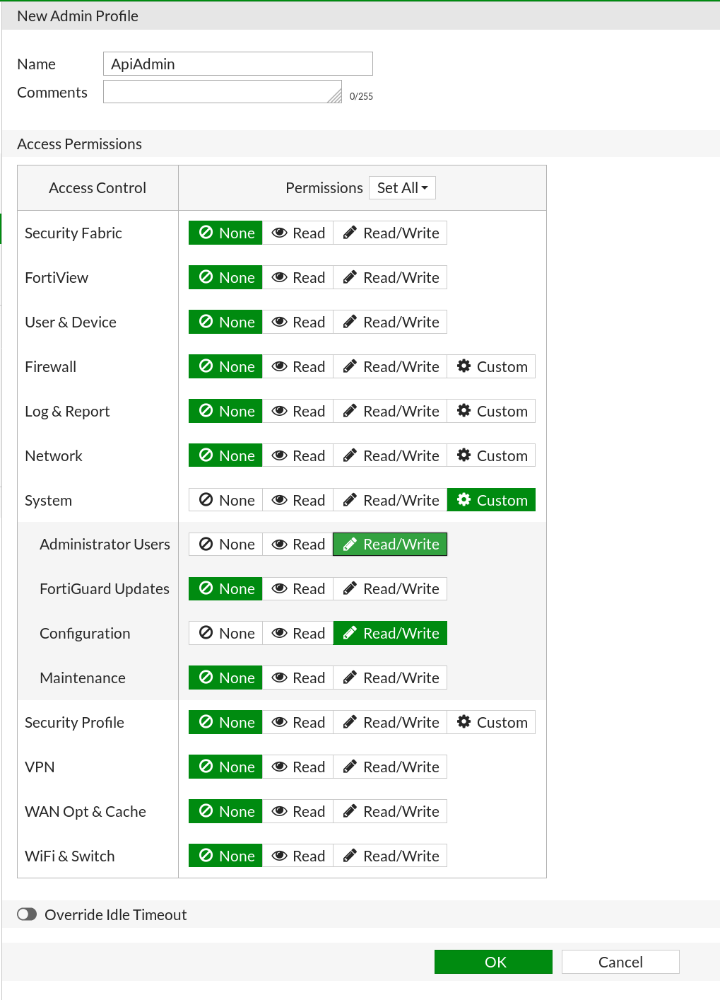
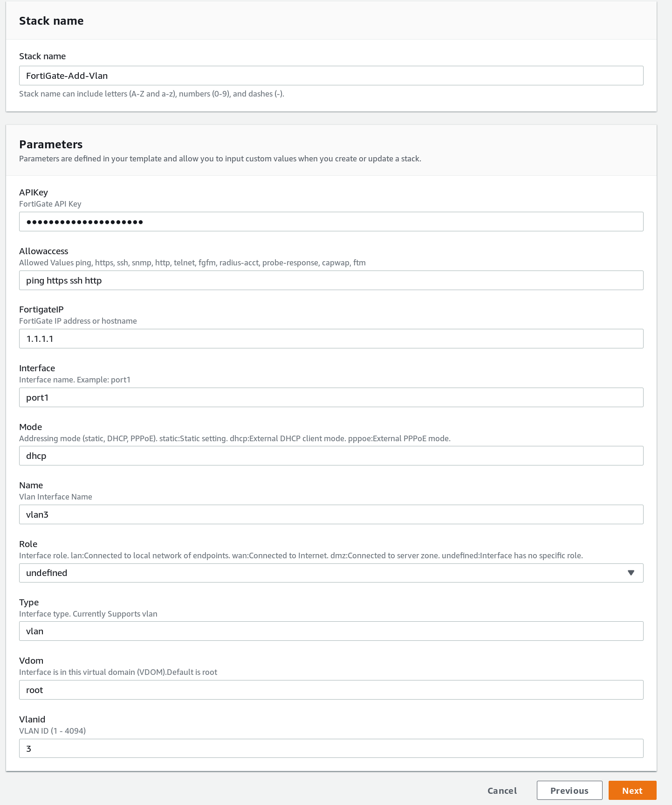

# Introduction
ForitGate CloudFormation resources allow you to interact with components of the FortiGate API through AWS CloudFormation.

# Requirements
* [AWS CLI](https://docs.aws.amazon.com/cli/latest/userguide/cli-chap-install.html)
* FortiGate must have a public IP address that is reachable from the Internet.

# Set up
1. Install the `cfn-cli` package.
2. Download the ZIP file for the required resource from S3.
    The Following resources are currently availble:
    [Create an Admin user](https://cloudformation-resource-provider.s3-us-west-2.amazonaws.com/fortinet-fortigate-systemadmin-handler-1.0-SNAPSHOT.jar)
    [Create a Vlan interface](https://cloudformation-resource-provider.s3-us-west-2.amazonaws.com/fortinet-fortigate-systeminterface-handler-1.0-SNAPSHOT.jar)
    [Update DNS](https://cloudformation-resource-provider.s3-us-west-2.amazonaws.com/fortinet-fortigate-systemdns-handler-1.0-SNAPSHOT.jar)
3. Locate the downloaded package and upload it to AWS CloudFormation using the command:
   ```sh
   cfn-cli submit -v --region <region>
   ```
4. Use the token output to monitor the registration process:
   ```sh
   aws cloudformation describe-type-registration --registration-token <token>
   ```
5. Once the registration is marked as complete you will be able to view the resource in your respective region.
6. Example CloudFormation Templates are available in the [Templates folder](./CloudFormationTemplates). These will provide a starting point for the resource used in CloudFormation.


# The API key
In order to use the custom FortiGate CloudFormation resources you will need to set up an API key on the FortiGate.

## Create an Administrator profile
1. Log in to your FortiGate.
2. Select **System > Admin Profiles > Create new**.
3. Populate the fields as show in the image:<br>
   
4. Click **OK**.

## Create the REST API Admin
1. Select **System > Administrators > Create new > REST API Admin**.
2. Use the **Administrtor Profile** you created.
3. Add these **Trusted Hosts**:
   * 63.0.0.0/3
   * 64.0.0.0/2
   * 128.0.0.0/1
   > **Note:** The 0.0.0.0/0 range is not supported. A call may come from many different AWS IP addresses. A full list of AWS ranges is available [here](https://docs.aws.amazon.com/general/latest/gr/aws-ip-ranges.html).
4. Click **OK**.

# Usage
To use a resource in AWS CloudFormation you will need to supply the required parameters. A resource schema can be viewed from the registry in AWS CloudFormation.

Each FortiGate resource requires an API key and a FortiGate IP address or hostname.
Dynamic secrets are not currently supported.

1. In the AWS console, click **Services > Management & Governance > CloudFormation**.
2. Click **Create Stack**.
3. Upload your CloudFormation Template. Examples can be found [here](./CloudFormationTemplates).
4. Specify the required parameters as shown in the image:<br>


# Troubleshooting
 A Log group in CloudWatch is automatically created when submitting the resource. To locate it, look in CloudWatch under the resource name.

Following are potential errors that may be returned by the FortiGate:
* 400 : Bad Request: Request cannot be processed by the AP
* 401 : Not Authorized: Request without successful login session
* 403 : Forbidden: Request is missing CSRF token or administrator is missing access profile permissions.
* 404 : Resource Not Found: Unable to find the specified resource.
* 405 : Method Not Allowed: Specified HTTP method is not allowed for this resource.
* 424 : Failed Dependency: Fail dependency can be duplicate resource, missing required parameter, missing required attribute, invalid attribute value.

Further troubleshooting can be done by logging into the FortiGate via `ssh` and entering the following commands:
```
diagnose debug enable

diagnose debug application httpsd -1
```
This will print debugging information when an API request is made.

# Support
Fortinet-provided scripts in this and other GitHub projects do not fall under the regular Fortinet technical support scope and are not supported by FortiCare Support Services.
For direct issues, please refer to the [Issues](https://github.com/fortinet/azure-security-group-update/issues) tab of this GitHub project.
For other questions related to this project, contact [github@fortinet.com](mailto:github@fortinet.com).

## License
[License](./LICENSE) © Fortinet Technologies. All rights reserved.